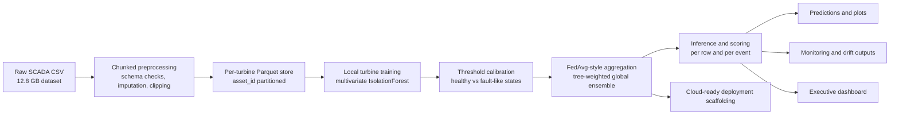
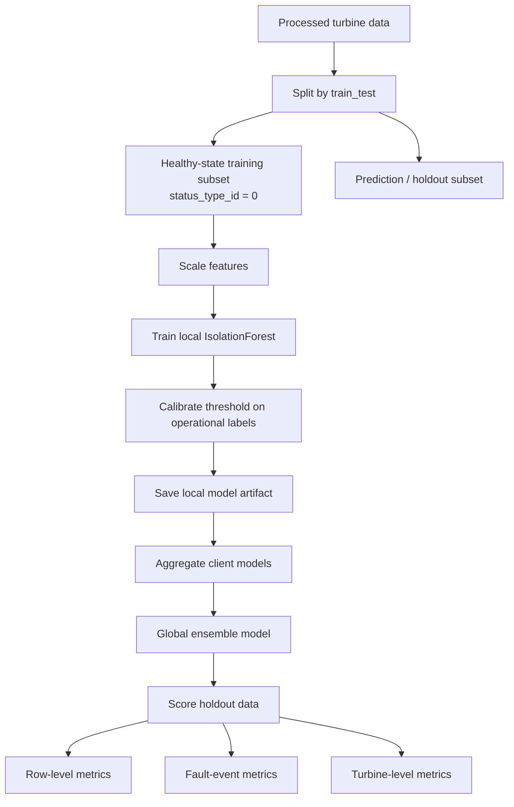
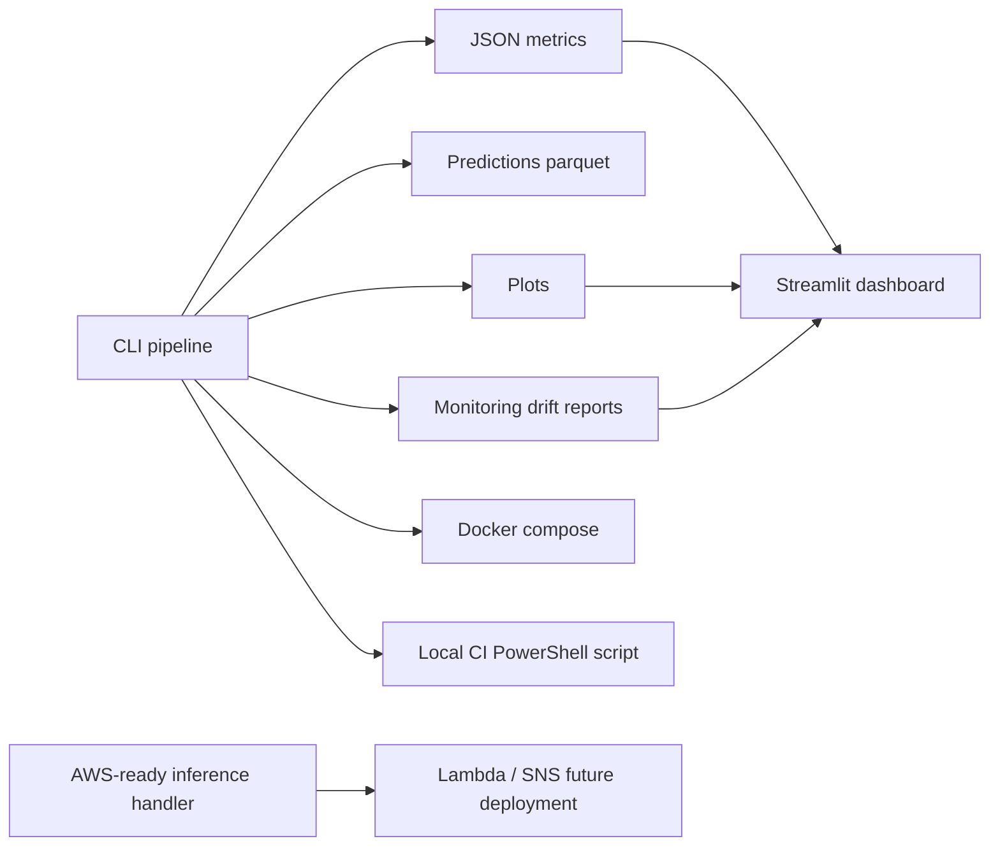

# Architecture

## System Architecture

## Training and Evaluation Flow

## Local Productization Stack

## Design Rationale

- `IsolationForest` was kept as the core model because it is the most consistent algorithmic choice across the project document and is easier to explain in a resource-constrained industrial setting.
- The aggregation layer is intentionally described as **FedAvg-style** rather than literal FedAvg for tree parameters, which keeps the architecture honest and technically defensible.
- Event-level evaluation was added because managers care more about catching meaningful fault periods than individual anomalous rows.
- The dashboard and drift reporting were added to make the project look and behave like an operational system rather than a one-off academic experiment.
